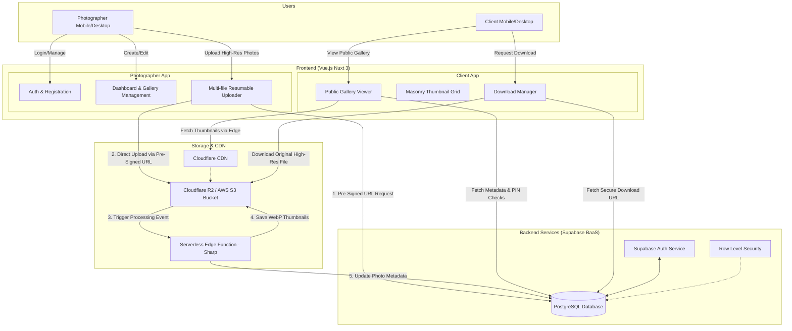

# EasyUpload Architecture

This document provides a visual and technical breakdown of the system architecture for our EasyUpload mobile upload and client gallery application.

## System Architecture Diagram

## Architecture Breakdown

### 1. The Users
*   **Photographer**: The primary user who authenticates, creates galleries, and manages heavy mobile uploads using native device capabilities (like camera rolls).
*   **Client**: The end-user who receives a link (potentially PIN-protected) and navigates the beautifully rendered, read-only gallery to view or download photos.

### 2. Frontend Layer (Nuxt 3)
*   **Photographer App**: Handled almost entirely client-side (SPA behavior) for smooth dashboard interactions. The cruical component here is the `Uploader`. It won't send large 20MB files through our Nuxt server; instead, it asks the database for a temporary secure "ticket" (Pre-Signed URL) and sends the file directly to the storage bucket, overcoming standard server memory limits.
*   **Client App**: Built using Server-Side Rendering (SSR). When a client clicks a link on their phone, the server builds the whole HTML gallery in milliseconds and serves it, meaning no "loading spinners" or lag.

### 3. Backend Data Layer (Supabase PostgreSQL)
*   Instead of maintaining a custom Node.js backend, we use Supabase to securely manage authentication (Email, Google, etc.).
*   **Row-Level Security (RLS)** ensures photographers can only edit their *own* galleries, and clients can only query the photos belonging to the specific gallery link they hold.

### 4. Storage & Processing Layer (Cloudflare R2/S3 & CDN)
*   This is the heavy lifter. All high-resolution originals go straight to the storage bucket (e.g., Cloudflare R2).
*   **Image Processing Edge Function**: When a 20MB raw file lands in the bucket, a background serverless function instantly wakes up, compresses it into a tiny WebP format (~100KB), and saves it as a "Thumbnail".
*   Clients view the thumbnails via a globally distributed **CDN**, making the gallery feel lightning fast anywhere in the world. They only touch the large original file when they explicitly hit the "Download" button.

## Next Step

This architecture is robust, highly scalable, and very cost-effective (especially with Cloudflare R2 preventing bandwidth fees on downloads). 

If this looks good, our first technical step is to set up the foundation:
**Initializing the Nuxt 3 project and generating the base folder structure.**
